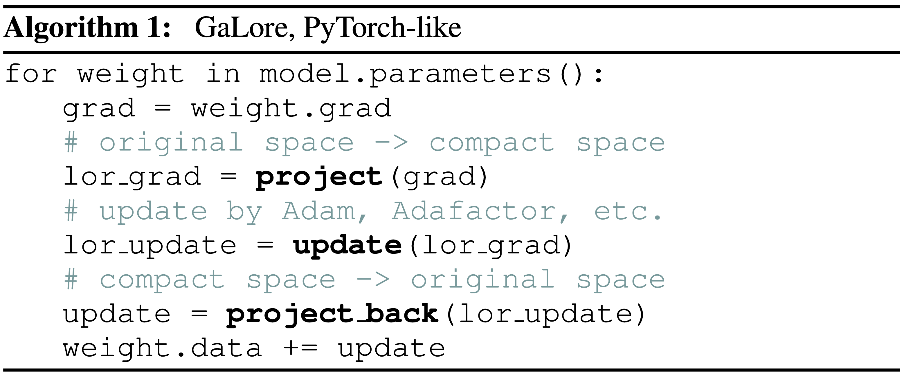

# GaLore

This repo contains the pre-release version of GaLore algorithm, proposed by [GaLore: Memory-Efficient LLM Training by Gradient Low-Rank Projection](https://arxiv.org/abs/2403.03507).

Gradient Low-Rank Projection (GaLore) is a memory-efficient low-rank training strategy that allows *full-parameter* learning but is more *memory-efficient* than common low-rank adaptation methods, such as LoRA.
As a gradient projection method, GaLore is independent of the choice of optimizers and can be easily plugged into existing ones with only two lines of code, as shown in Algorithm 1 below.

<div align="center">
  
</div>

## News


- **2024-09-01**: We are working on GaLore 2, which is a more efficient and accessible version of GaLore. Please stay tuned!
- **2024-07-11**: We release Q-GaLore: Quantized GaLore with INT4 Projection. [[paper](https://arxiv.org/abs/2407.08296)] [[code](https://github.com/VITA-Group/Q-GaLore)]

- **2024-07-01**: GaLore is accepted to ICML 2024 as Oral! 

- **2024-04-20**: Please join our Slack workspace [GaLore-Social](https://join.slack.com/t/galore-social/shared_invite/zt-2ev152px0-DguuQ5WRTLQjtq2C88HBvQ) to discuss with us and the community.

## Installation

### Install GaLore optimizer
Install from pip:
```bash 
pip install galore-torch
```

or if you want to install from source:

```bash
git clone git@github.com:jiaweizzhao/GaLore.git
cd GaLore
pip install -e .
```

### Install experiment dependencies

```bash
pip install -r exp_requirements.txt
```

Our experiment scripts are tested on Python 3.8 with PyTorch 2.1.

## Usage

### Save optimizer memory using GaLore optimizers

```python
from galore_torch import GaLoreAdamW, GaLoreAdamW8bit, GaLoreAdafactor
# define param groups as galore_params and non_galore_params
param_groups = [{'params': non_galore_params}, 
                {'params': galore_params, 'rank': 128, 'update_proj_gap': 200, 'scale': 0.25, 'proj_type': 'std'}]
optimizer = GaLoreAdamW(param_groups, lr=0.01)
```
### Save weight gradient memory using per-layer weight updates

We use `register_post_accumulate_grad_hook` provided by [PyTorch](https://pytorch.org/tutorials/intermediate/optimizer_step_in_backward_tutorial.html) (`torch>=2.1.0`) to enable per-layer weight updates. An example is shown below:

```python
# define an optimizer for each parameter p, and store them in optimizer_dict
for p in model.parameters():
    if p.requires_grad:
        optimizer_dict[p] = GaLoreAdamW([{'params': p, 'rank': 128, 'update_proj_gap': 200, 'scale': 0.25, 'proj_type': 'std'}], lr=0.01)

# define a hook function to update the parameter p during the backward pass
def optimizer_hook(p):
    if p.grad is None: 
        return
    optimizer_dict[p].step()
    optimizer_dict[p].zero_grad()

# Register the hook onto every parameter
for p in model.parameters():
    if p.requires_grad:
        p.register_post_accumulate_grad_hook(optimizer_hook)
```
More details can be found in [torchrun_main.py](https://github.com/jiaweizzhao/GaLore/blob/a6bc1650984b1c090a4e108d7c0e3109ee7ad844/torchrun_main.py#L334).

## Benchmark 1: Pre-Training LLaMA on C4 dataset
`torchrun_main.py` is the main script for training LLaMA models on C4 with GaLore. Our benchmark scripts for various sizes of models are in `scripts/benchmark_c4` folder.
For example, to train a 60m model on C4, do the following:

```bash
# LLaMA-60M, GaLore-Adam, 1 A100, 1 Node
torchrun --standalone --nproc_per_node 1 torchrun_main.py \
    --model_config configs/llama_60m.json \
    --lr 0.01 \
    --galore_scale 0.25 \
    --rank 128 \
    --update_proj_gap 200 \
    --batch_size 256 \
    --total_batch_size 512 \
    --num_training_steps 10000 \
    --warmup_steps 1000 \
    --weight_decay 0 \
    --dtype bfloat16 \
    --eval_every 1000 \
    --optimizer galore_adamw 
```

### Train 7B model with a single GPU with 24GB memory
To train a 7B model with a single GPU such as NVIDIA RTX 4090, all you need to do is to specify `--optimizer=galore_adamw8bit_per_layer`, which enables `GaLoreAdamW8bit` with per-layer weight updates.
With activation checkpointing, you can maintain a batch size of 16 tested on NVIDIA RTX 4090.

```bash
# LLaMA-7B, 8-bit GaLore-Adam, single GPU, activation checkpointing
# bsz=16, 22.8G, 
torchrun --standalone --nproc_per_node 1 torchrun_main.py \
    --model_config configs/llama_7b.json \
    --lr 0.005 \
    --galore_scale 0.25 \
    --rank 1024 \
    --update_proj_gap 500 \
    --batch_size 16 \
    --total_batch_size 512 \
    --activation_checkpointing \
    --num_training_steps 150000 \
    --warmup_steps 15000 \
    --weight_decay 0 \
    --grad_clipping 1.0 \
    --dtype bfloat16 \
    --eval_every 1000 \
    --single_gpu \
    --optimizer galore_adamw8bit_per_layer
```

Currently per-layer weight updates technique is only supported for single GPU training (`--single_gpu`) without using `nn.parallel.DistributedDataParallel`. We are working on supporting multi-GPU training with per-layer weight updates.

## Benchmark 2: Fine-Tuning RoBERTa on GLUE tasks
`run_glue.py` is the main script for fine-tuning RoBERTa models on GLUE tasks with GaLore. An example script is shown below:

```bash
python run_glue.py \
    --model_name_or_path roberta-base \
    --task_name mrpc \
    --enable_galore \
    --lora_all_modules \
    --max_length 512 \
    --seed=1234 \
    --lora_r 4 \
    --galore_scale 4 \
    --per_device_train_batch_size 16 \
    --update_proj_gap 500 \
    --learning_rate 3e-5 \
    --num_train_epochs 30 \
    --output_dir results/ft/roberta_base/mrpc
```

## Citation
```bibtex
@misc{zhao2024galore,
      title={GaLore: Memory-Efficient LLM Training by Gradient Low-Rank Projection}, 
      author={Jiawei Zhao and Zhenyu Zhang and Beidi Chen and Zhangyang Wang and Anima Anandkumar and Yuandong Tian},
      year={2024},
      eprint={2403.03507},
      archivePrefix={arXiv},
      primaryClass={cs.LG}
}
```